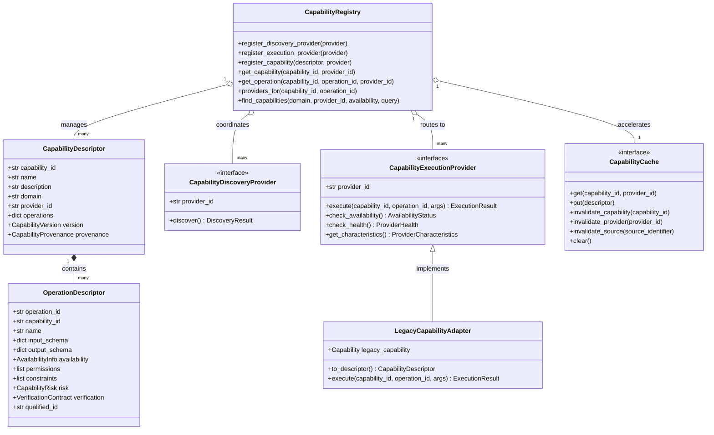

# ADR-002: MAX Dynamic Capability Platform Architecture

## Status
Accepted

## Context & Motivation
In Phase 1, MAX achieved truthful execution and closed verification gaps on macOS by enforcing:
$$\text{EXECUTION SUCCESS} \neq \text{GOAL SUCCESS}$$
$$\text{POSTCONDITION OBSERVED} \implies \text{SATISFIED}$$
$$\text{POSTCONDITION NOT PROVEN} \implies \text{UNKNOWN}$$

However, Phase 1 relied on a static, hardcoded capability registry where capability names (e.g. `filesystem`, `terminal`, `applications`) mapped 1:1 to monolithic Python classes. As MAX evolves into a general-purpose local macOS agent, capabilities must be dynamically discoverable from diverse external and operating-system sources:
- Native macOS APIs & Frameworks
- App Intents (macOS 13+)
- Shortcuts enumeration
- macOS Accessibility UI hierarchies
- Model Context Protocol (MCP) servers
- Browser automation interfaces

Building a separate subsystem or hardcoded registry for each future provider would lead to architectural fragmentation. Phase 2.0 establishes a canonical, strongly typed, provider-independent capability foundation that decouples **WHAT** MAX can do from **HOW** it is implemented, without weakening Phase 1 verification guarantees.

---

## Architecture Overview



---

## Detailed Architectural Decisions

### 1. Capability vs. Operation vs. Provider Identity
The architecture separates three distinct axes:
- **Capability (`capability_id`):** The logical entity or resource in macOS (e.g. `system.application`, `filesystem.file`, `terminal.command`, `display.brightness`).
- **Operation (`operation_id`):** The concrete action performed on that entity (e.g. `open`, `write`, `execute`, `set`).
  - Canonical qualified identity: `f"{capability_id}.{operation_id}"` (e.g. `system.application.open`).
- **Provider (`provider_id`):** The implementation engine supplying that operation (e.g. `native_macos`, `accessibility`, `apple_script`, `mcp`).

This allows determining capability, operation, and provider independently.

### 2. Separation of Discovery from Execution
Not all capability sources execute their own capabilities:
- `CapabilityDiscoveryProvider`: Implements `discover() -> DiscoveryResult` to find capabilities dynamically (e.g. scanning application bundles, parsing Shortcuts, probing MCP endpoints).
- `CapabilityExecutionProvider`: Implements `execute(capability_id, operation_id, args) -> ExecutionResult` to execute operations.
- Providers may implement both or only one.

### 3. Multi-Provider Registry Support
A core requirement is that multiple providers can offer the same canonical capability simultaneously:
```text
Capability: system.application.open
├── Provider: native_macos
├── Provider: accessibility
└── Provider: mcp
```
When `accessibility` registers `system.application.open`, it **does not overwrite** `native_macos`. Both providers are preserved in `providers_for("system.application", "open")`.

### 4. Explicit Availability Taxonomy
Availability is represented as an explicit lifecycle enum rather than a boolean:
- `AVAILABLE`: Ready for immediate execution.
- `UNAVAILABLE`: Not supported on this hardware/architecture.
- `PERMISSION_REQUIRED`: Capability recognized, but required macOS permission (e.g. TCC Accessibility) is not yet granted.
- `PERMISSION_DENIED`: Explicitly refused by user or security policy.
- `NOT_INSTALLED`: Binary or application bundle is not present on the disk.
- `DISABLED`: Administratively or configurationally toggled off.
- `TEMPORARILY_UNAVAILABLE`: Busy, rate-limited, or transiently disconnected.
- `UNKNOWN`: Unprobed.

### 5. Generic Execution Constraints
Rather than hardcoding application-specific rules, `CapabilityConstraint` allows operations to declare environmental prerequisites:
- `REQUIRED_PERMISSION` (e.g. TCC Accessibility)
- `OS_VERSION` (e.g. macOS >= 14.0 for specific App Intents)
- `REQUIRED_APPLICATION` (e.g. target application must be installed)
- `PROVIDER_STATE`, `ENVIRONMENT`, `INPUT_RANGE`, `TARGET_TYPE`

### 6. Provider Characteristics for Evidence-Based Selection
`ProviderCharacteristics` exposes structured metadata for future ranking:
- `reliability_score` (0.0 to 1.0)
- `expected_latency_tier` (`INSTANT`, `FAST`, `NORMAL`, `SLOW`)
- `verification_quality` (`HIGH`, `MEDIUM`, `LOW`, `NONE`)
- `risk_level` (`SAFE`, `LOW`, `MEDIUM`, `HIGH`, `BLOCKED`)
- `provider_type` (`NATIVE`, `APPLE_SCRIPT`, `ACCESSIBILITY`, `MCP`, `EXTERNAL`)

### 7. Verification Contract as a First-Class Citizen
Every `OperationDescriptor` declares its `VerificationContract`:
- `strategy`: `DIRECT_OBSERVATION`, `FILESYSTEM_OBSERVATION`, `ACCESSIBILITY_OBSERVATION`, `PROCESS_OBSERVATION`, `BROWSER_OBSERVATION`, `TERMINAL_OBSERVATION`, `MODEL_ASSISTED`, `NONE`, `UNKNOWN`.
- `is_verifiable`: Whether an independent postcondition can be checked.
- `independent_observer_required`: Enforces that the execution provider cannot verify itself.
- **Rule:** Unverifiable operations yield `UNKNOWN`, never `SATISFIED`.

### 8. Real Provenance Tracing
`CapabilityProvenance` tracks:
- `provider_id`: Who discovered it.
- `discovery_mechanism`: How it was discovered (`static`, `app_intents`, `shortcuts`, `mcp`, etc.).
- `source_identifier`: Exact origin (e.g. bundle ID `com.apple.Safari`).
- `source_version`, `discovered_at`, and `environment`.
- Information is never fabricated; missing attributes remain `None`.

### 9. Structured Discovery Failure Semantics
`DiscoveryResult` differentiates between distinct operational outcomes:
- **Empty Discovery:** `is_empty == True` (discovery completed successfully, found 0 items).
- **Discovery Error:** `errors` populated with `DiscoveryError` (probe failed; existence unknown).
- **Permission-Blocked:** `permission_blocked` populated with `PermissionBlockedDiscovery` (TCC blocked).

### 10. Cache Invalidation Contract
The `CapabilityCache` (implemented by `InMemoryCapabilityCache`) accelerates lookups without being an authoritative source of truth. It supports targeted invalidation:
- `invalidate_capability(capability_id)`
- `invalidate_provider(provider_id)`
- `invalidate_source(source_identifier)` (e.g. when an app is updated or uninstalled)
- `clear()`

### 11. One-Way Legacy Compatibility Layer
`LegacyCapabilityAdapter` wraps Phase 1 `Capability` objects without making new architecture depend on legacy code. The registry transparently exposes legacy methods (`register`, `get`, `list_capabilities`, `get_all_schemas`, `is_operation_supported`, `get_structured_catalog`, `execute`), ensuring zero regressions across all existing tests.

---

## Future Extensibility
Future discovery engines plug directly into this platform without changing core models:
- **App Intents:** `AppIntentsDiscoveryProvider` generates `CapabilityDescriptor`s with `VerificationStrategy.DIRECT_OBSERVATION`.
- **Shortcuts:** `ShortcutsDiscoveryProvider` registers workflows under `domain="shortcuts"`.
- **Accessibility:** `AccessibilityDiscoveryProvider` enumerates live window/menu actions.
- **MCP:** `McpDiscoveryProvider` translates MCP tools into canonical descriptors.
- **Browser Automation:** `BrowserDiscoveryProvider` registers DOM/tab operations with `VerificationStrategy.BROWSER_OBSERVATION`.
